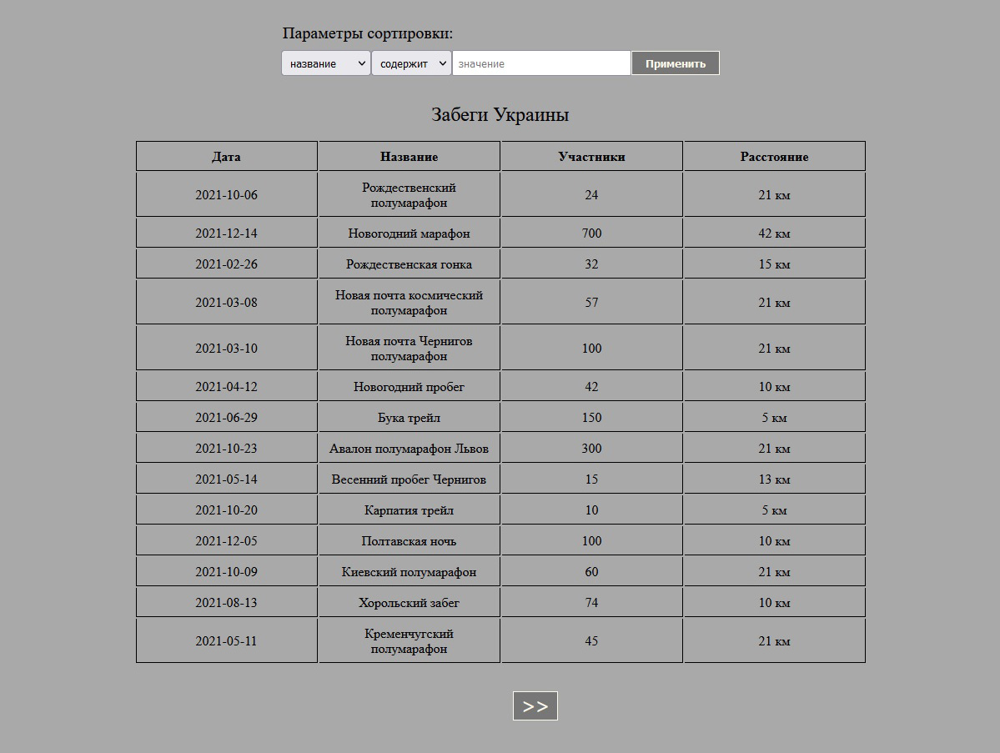

#  Table of Running Events

A simple table that fetches events' data from database with filter available.

**Important:** Before running this app, go to server/db/db.js and change values for 'user' and 'password'.
In the same folder you can find a dump of running_events database.

### Technologies used:
- React
- Node.js
- Express
- PostgreSQL

**Important:** Before running this app, go to server/db/db.js and change values for 'user' and 'password'.
In the same folder you can find a dump of running_events database.
